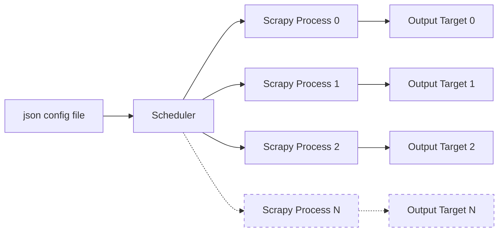

# Architecture

A basic representation of our architecture is below.  Here you can see a JSON configuration file feeding into a scheduler process which, in turn, launces multiple scrapy processes, each capable of writing to its own target system. The number of concurrent jobs is configurable within the system.

The [Scrapy documentation](https://docs.scrapy.org/en/latest/topics/architecture.html) does a good job of explaning the internals of Scrapy, which for us, is encapsulated in each of the "Scrapy Process" blocks above.
