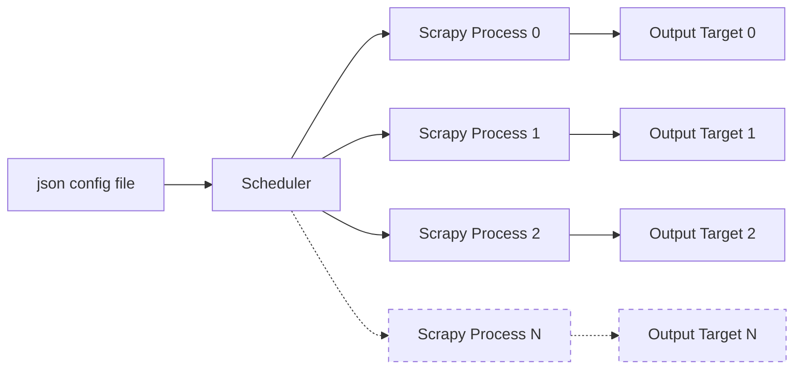
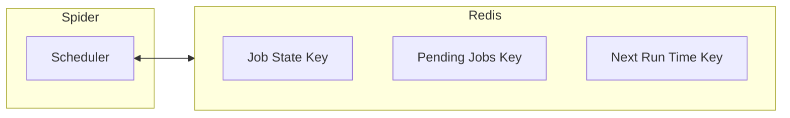

# Architecture

## High Level Diagram
A basic representation of our architecture is below.  Here you can see a JSON configuration file feeding into a scheduler process which, in turn, launces multiple scrapy processes, each capable of writing to its own target system. The number of concurrent jobs is configurable within the system.

The [Scrapy documentation](https://docs.scrapy.org/en/latest/topics/architecture.html) does a good job of explaning the internals of Scrapy, which for us, is encapsulated in each of the "Scrapy Process" blocks above.

## Scheduler State
The state of the scheduler is stored in Redis so that it can persist between restarts and deployments.  The spider scheduler uses three keys: one to hold information about the job (Job State), one to hold information about the next time the job will run (Next Run Time), and a third that keeps tracks of jobs that have been sent to the executor but have not yet finished (Pending Jobs).  The Job State and Next Run Time keys are native to APScheduler.  The Pending Jobs key is a custom Spider APSchedule extension that allows us to keep our often significantly large queue of jobs in place between restarts or deployments.

## Output Targets
We support three output targets for our scrapy jobs.  These are specified in a `crawl-sites.json` file or as a command line argument to a scrapy or benchmark job.  The options are:

1. `csv` - This is the default and if selected will output all scraped URLs to csv files in the [output folder](../search_gov_crawler/output/)

2. `endpoint` - This is used to send links to a indexing service, such as searchgov.  All URLs will be posted to the endpoint contained in the `SPIDER_URLS_API` environment variables.

3. `elasticsearch` - This option is used to post content to an Elasticsearch host and index based on environment variable configurations.  Here, it is not just the links being captured but also the content.
